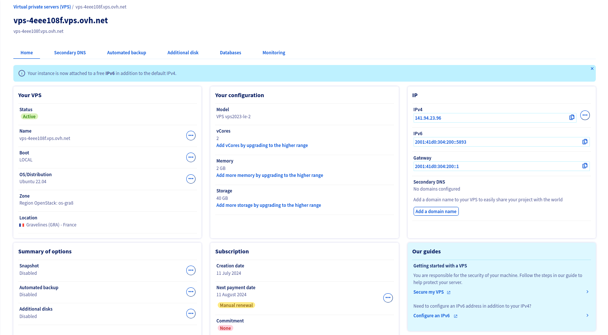
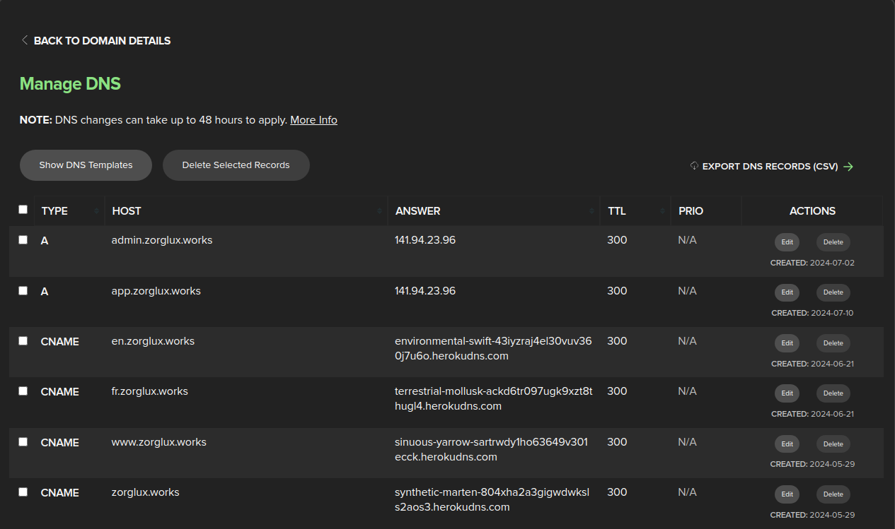
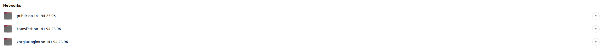

# Zorglux

---

## Contexte

Ce projet consiste à héberger une application web de blog. L'application comprend un front, un back et une base de données (PostgreSQL). 
Nous avons déployé cette application sur un [VPS](vps-4eee108f.vps.ovh.net) fourni par [OVH](https://www.ovhcloud.com/fr/) et avons utilisé un nom de domaine enregistré chez [name.com](name.com).

## Membre de l'équipe (Groupe )

1. RAKOTONIAINA Johan Mickaël
2. SALAMANI Sarah Lina

## Technologies utilisées

- Frontend: Symfony UX, Tailwind CSS, Twig
- Backend: Symfony
- Base de données: PostgreSQL
- Serveur: Nginx
- Conteneurisation: Docker

## Fonctionnalités
- Authentification
- CRUD d'articles
- Commentaires
- SEO automatisé

## Déploiement

### 1. VPS
- Fournir d'un VPS

- Installation de docker sur le VPS 
- Cloner le projet sur le VPS

### 2. Nom de domaine
- Enregistrement d'un nom de domaine
- Configuration du nom de domaine pour pointer vers le VPS


### 3. Accès ssh
- Generation de clé ssh
```bash
 ssh-keygen -t ed25519 -C "user@domain.suffix"
```
- Copie de la clé publique sur le VPS
```bash
ssh-copy-id -i ~/.ssh/id_ed25519.pub ubuntu@141.94.23.96
```

- Accès ssh
```bash
ssh ubuntu@141.94.23.96
```

### 4. Certificat SSL avec Certbot
- Ajout d'une image certbot dans le fichier docker-compose.yml
- Exécution de la commande suivante pour obtenir un certificat SSL
```bash
docker-compose run --rm certbot certonly --webroot --webroot-path=/var/www/html -d app.zorglux.works -d admin.zorglux.works
```

### 5. Configuration de Nginx
- Ajout d'une image nginx dans le fichier docker-compose.yml
- Configuration de Nginx pour rediriger le trafic HTTP vers HTTPS
- Configuration de Nginx pour utiliser le certificat SSL
- Configuration de Nginx pour rediriger le trafic vers le conteneur Docker

### 6. Fail2ban
- Installation de fail2ban sur le VPS
- Configuration de fail2ban pour bloquer les adresses IP après des tentatives de connexion infructueuses

### 7. Samba
- Installation de Samba sur le VPS
- Configuration de Samba pour partager des fichiers entre le VPS et un ordinateur local
- Configuration de Samba pour accéder aux fichiers partagés depuis un ordinateur local
